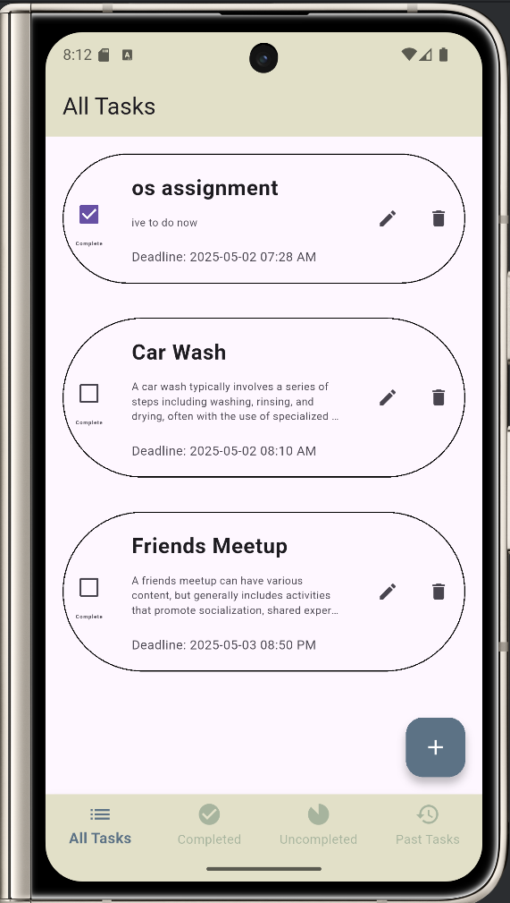
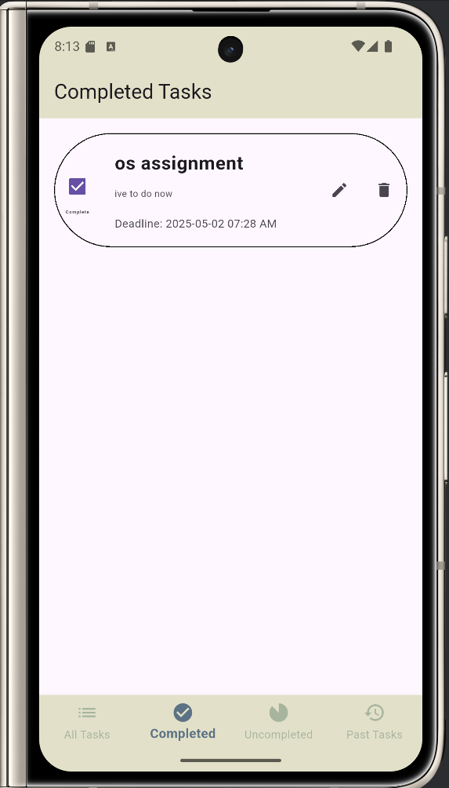
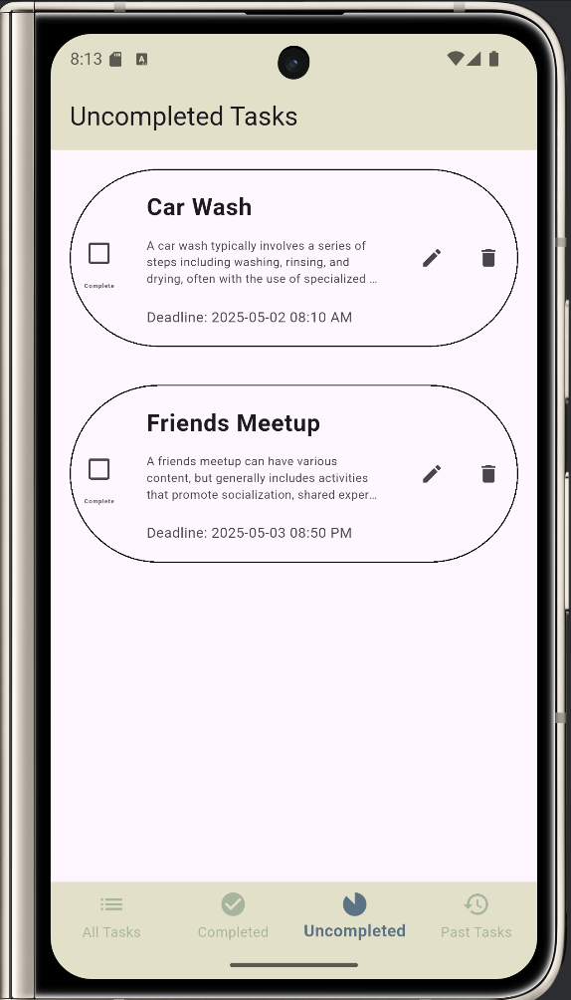
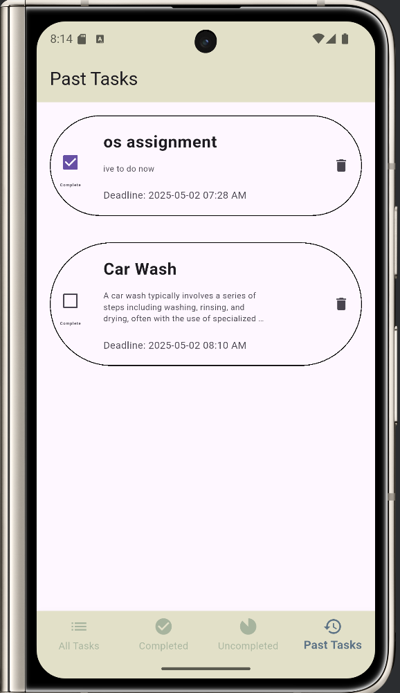
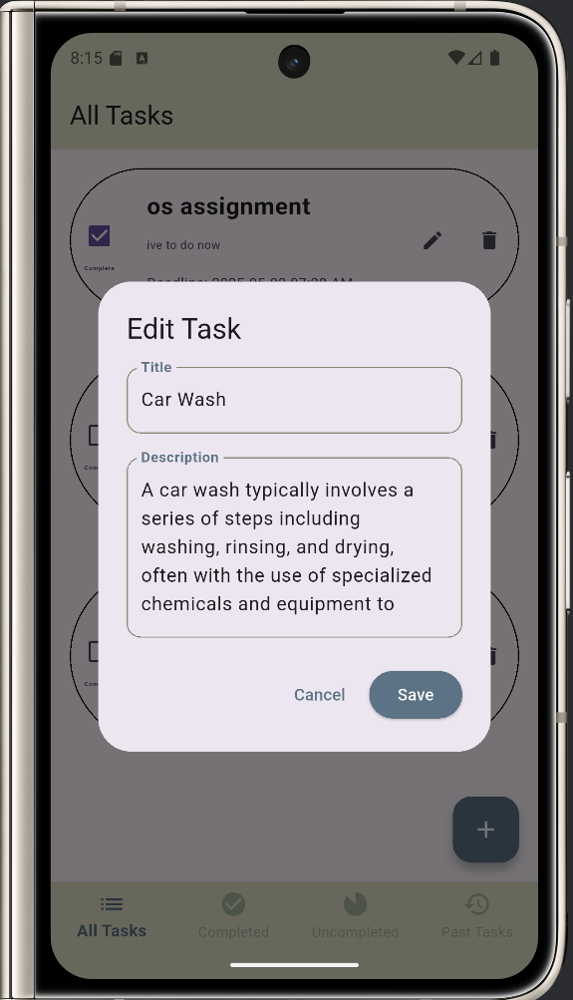
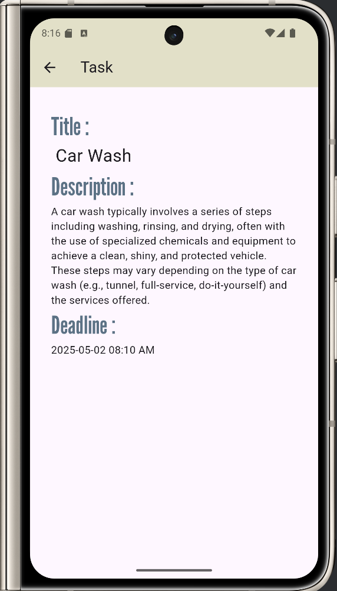
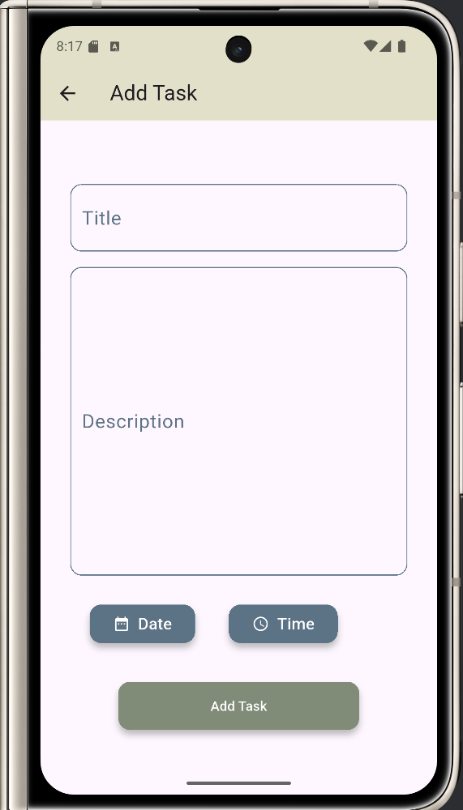
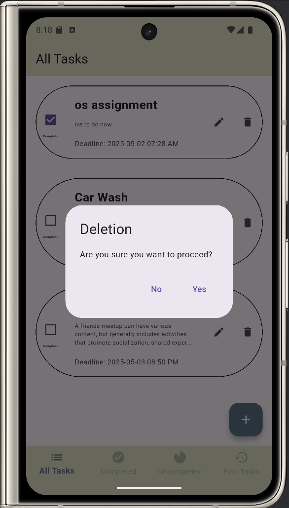

# To-Do List App

A simple Flutter to-do list application built in Android Studio.

## Features
- All, completed, uncompleted and past tasks
- Add, delete, and edit the tasks
- Persistent storage using shared preferences / database
- Clean and responsive UI

## Getting Started
- Clone the repo
- Run `flutter pub get`
- Launch in emulator or device

## Screenshots

## License
MIT